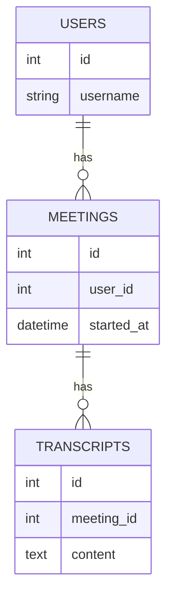

# Диаграмма базы данных

Файл описывает упрощённую структуру таблиц сервиса.

```mermaid
erDiagram
    USERS ||--o{ MEETINGS : has
    MEETINGS ||--o{ TRANSCRIPTS : has

    USERS {
        int id
        string username
    }
    MEETINGS {
        int id
        int user_id
        datetime started_at
    }
    TRANSCRIPTS {
        int id
        int meeting_id
        text content
    }
```
