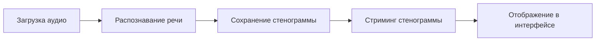

# Общая схема работы сервиса

Диаграмма демонстрирует основные этапы распознавания аудио.

```mermaid
flowchart LR
    A[Загрузка аудио] --> B[Распознавание речи]
    B --> C[Сохранение стенограммы]
    C --> D[Стриминг стенограммы]
    D --> E[Отображение в интерфейсе]
```
